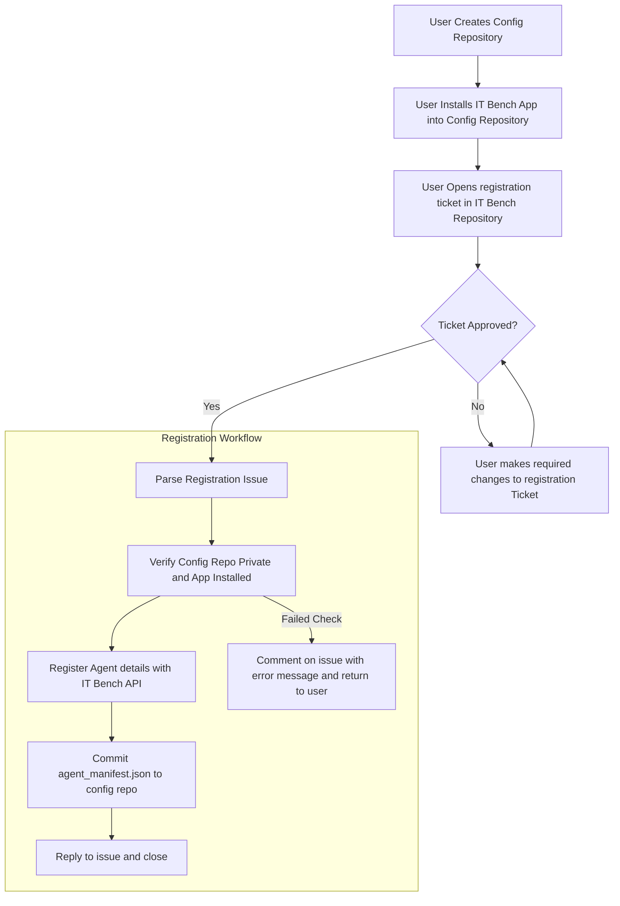
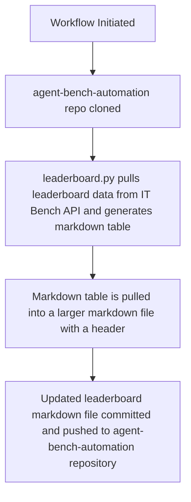

# GitHub Actions Documentation for IT Bench

## General

To support the IT Bench user experience, this repository contains a number of GitHub Actions workflows that automate required tasks.

These include:
 - [Agent Registration](#agent-registration)
 - [Public Leaderboard Updates](#public-leaderboard-updates)


## Agent Registration





### Simple onboarding instructions for users


To onboard your agent and get started benchmarking, please follow the following steps:

1. Create an empty repository (or use a repository of your choice) on GitHub:
    - The repository must be set to private.
    - The onboarding process will create a file called `agent-manifest.json` at the root of the repository, so if using an existing repository make sure that there will not be a clash.
2. Install the [`ibm-itbench`](https://github.com/apps/ibm-itbench) app into the repository that you created in step 1.
3. Fill out and submit [this issue template](https://github.com/jpwsutton/itbenchautomation/issues/new?template=onboarding.yaml) with the details of the agent you are developing and provide the URL to the GitHub Repo you created in step 1 e.g. https://github.com/jpwsutton/my-test-agent
4. Once the registration issue has been approved, an automated process will generate a manifest for your agent to access the IT Bench Server and will save it to the root of your repository from step 1. You can now download this file and use it with the agent harness to initiate a benchmark. 


## Public Leaderboard updates




## Setup


### Creating the GitHub Application and configuring for GH Actions

1. Go to your [GitHub Apps page](https://github.com/settings/apps) in your developer settings and click "New GitHub App"
2. Populate the following Settings:
    - GitHub App name
    - Homepage URL (Set to the IT Bench Repo)
    - Disable Webhook
    - Permissions:
        - Repository Permissions:
            - Metadata: Read-Only (Default)
            - Single file: Read and Write
                - Path: agent-manifest.json
        - Organisation Permissions: None
        - Account Permissions: None
    - Where can this GitHub App be installed? - Any Account
3. Within the App settings, generate a private key and backup in 1password.
4. In the GitHub Repo Settings:
    - Environments - Create a new environment called `onboarding`
        - Environment Secrets:
            - `ITBENCH_APP_KEY` - Set to the generated Private Key from step 3
            - `ITBENCH_API_TOKEN` - Set to the JWT token for the IT Bench API
        - Environment Variables:
            - `ITBENCH_APP_ID` - Set to the App ID number
            - `ITBENCH_API` - The IT Bench Server API Endpoint
    - Actions:
        - Allow all actions and reusable workflows
        - Require approval for all external contributors
        - Read and write permissions
    - Runners (If using an external runner)
        - Create the runner using default options.
5. In the issues view create the following labels:
    - `approved`
    - `benchmark`
    - `error`
    - `registering`
    - `registration`


### Self hosted runners

Because the IT Bench Service is currently running on an internal IBM server, the workflow actions require a self hosted runner with access to the IBM internal network in order to run. The one extra step is to set up the certificate for the internal IT bench server as it is not trusted.

You can download the certificate (in case the server changes) by running the following command:

```bash
openssl s_client -showcerts  -connect tokyo-itbench-1.sl.cloud9.ibm.com:443 2>/dev/null </dev/null |  sed -ne '/-BEGIN CERTIFICATE-/,/-END CERTIFICATE-/p'
```

Setting up a self hosted runner is relatively straightforward to do:
1. In the relevant GitHub Repository, go to Settings  -> Runners and follow the process to create and install a new self hosted runner either on your local machine or an appropritate server on the IBM Network. 
2. Create a file on the same machine where the self hosted runner will run called `itbench_res.pem` and enter the ca certificate below:

```
-----BEGIN CERTIFICATE-----
MIIDmDCCAoCgAwIBAgIUFwWsO8VVH739Qa87EH+Y8mPtm40wDQYJKoZIhvcNAQEL
BQAwbTELMAkGA1UEBhMCVVMxETAPBgNVBAgMCE5ldyBZb3JrMREwDwYDVQQHDAhZ
b3JrdG93bjEMMAoGA1UECgwDUmVzMSowKAYDVQQDDCF0b2t5by1pdGJlbmNoLTEu
c2wuY2xvdWQ5LmlibS5jb20wHhcNMjUwMjEwMDk1MTI5WhcNMjYwMjEwMDk1MTI5
WjBtMQswCQYDVQQGEwJVUzERMA8GA1UECAwITmV3IFlvcmsxETAPBgNVBAcMCFlv
cmt0b3duMQwwCgYDVQQKDANSZXMxKjAoBgNVBAMMIXRva3lvLWl0YmVuY2gtMS5z
bC5jbG91ZDkuaWJtLmNvbTCCASIwDQYJKoZIhvcNAQEBBQADggEPADCCAQoCggEB
AI6VKg8jSfLwL7qsn6J/20OY9FrFhOVfZLONdFl/JcgPAX/GT28FbsJWpLsrv5kY
uGCZ9/A/ybfa8vBAQPRKd0EvOP++yJ9mNdeKlamTw6IZ2uzdop+VCya+UKZw1a3G
2++PjIbv9eno/uBQkA/6jyQGHmQXpdlqkgstr049Attag5Nq3H3cwFap8ev7bbBc
8wDqn3O+k/ZrQhMCwmivq4dTyhzWEhepcyEMfUnX2Q8uuB9Dn6JSWd99nKL5kP9L
sPR5RMFRIWd8Ly1XWqbfbg6GNEUvjrwjV9NVti7NfrzN6dW1E/EYd7nCroP/nEsd
ENjvBSAk3qEXLLqzy/CwDf8CAwEAAaMwMC4wLAYDVR0RBCUwI4IhdG9reW8taXRi
ZW5jaC0xLnNsLmNsb3VkOS5pYm0uY29tMA0GCSqGSIb3DQEBCwUAA4IBAQAVNQ+G
mD6B1CiM8ivpwdv7SKIj3NaUdTEtgbGmAkUhqF164S9D1r8rS0xUT5I7eiN1bCeM
zlXryMjIu3wSig3iN4Eng6RA6qiGcttd//PGg7Ftmvz4OgCj15nTQYmDKqzldf9w
kptFCF91GaQMoPbzgMDOXOoHCxOPVjnqcFJfWF36DkE/g4E09H6PuBjqFt73rHOo
hB6eiBJigoWYTIFryyPIH5KaMTqyDNCKLbqEMgyRlo0D0ZnHGWMI9FkF3r2bMb7p
PAJ1xNviYcUUdVcPQ81H2hHejnFPTtRnnjBwLf6DV4EulVLEOmutbwuxvAvwkpM3
IsI+erZxjtK7paPl
-----END CERTIFICATE-----
```
3. Go into the `actions-runner` directory and edit the `.env` file, adding the following line:
`ITBENCH_CERT=/path/to/itbench_res.pem`.
4. Start the runner with `./run.sh`


### Switching to a public runner

At some point, the IT bench server will be set up on the public internet. This will require a number of small changes, which are listed here:

1. For all workflows, ensure that the `runs-on` field has been changed from `self-hosted` to `ubuntu-latest`.
2. Remove the `ITBENCH_CERT` references:
    - `agent_registration.yaml`: Remove `--cacert $ITBENCH_CERT \` from the curl command in the `generate-manifest` step.
    - `leaderboard.py`:
        - Remove the `ITBENCH_CERT` environment variable from the top of the file.
        - Remove the ssl context from the `get_leaderboard` function.
        - Remove the `context` argument from the request call in the `get_leaderboard` function.